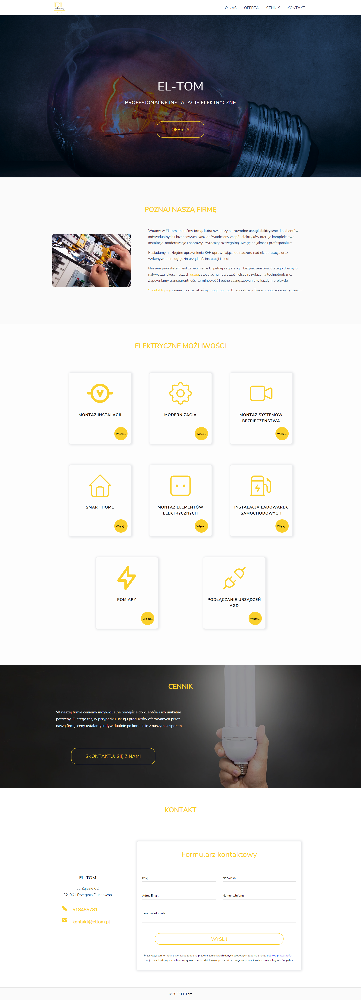

# Eltom

This website was created as a practice project to improve skills in design, optimisation and client collaboration.

Adopting the latest SEO and optimisation standards was a priority and the project allowed me to gain valuable experience working on a website from start to finish.

Live demo: [Eltom](https://eltom.online/)

## Table of Contents

- [General Info](#general-information)
- [Technologies Used](#technologies-used)
- [Screenshots](#screenshots)
- [Contact](#contact)

## General Information

- The main purpose of this project was to gain practical experience in developing websites according to the latest optimisation and SEO standards. It was an excellent exercise to improve skills in this area.

- The project also enabled me to gain experience in working with clients, meeting their needs and expectations.

- I designed the entire website myself, using design tools such as Figma. This allowed me to develop my design skills.

- I created my first working form using PHP, which was a valuable experience in server-side programming.

## Technologies Used

- 

- 

- 

- 

- 

## Screenshots

## Contact

Created by [@Max Szymański](https://github.com/maxszymanski) - feel free to contact me!
